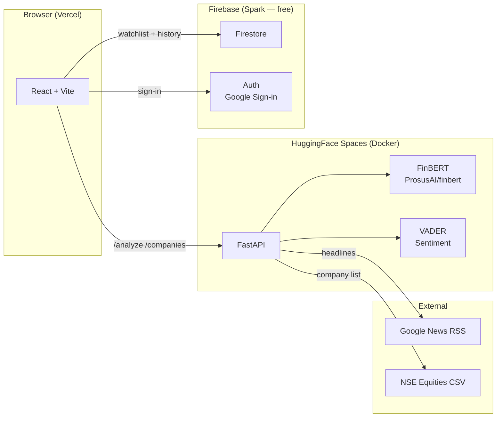

# finspire

> AI-powered market sentiment analysis for Indian stocks — powered by FinBERT + VADER.

[](https://github.com/sudarshankand/finspire/actions/workflows/ci.yml)
&nbsp;
[](https://finspire.vercel.app)
&nbsp;
[](https://huggingface.co/spaces/reddingpan/finspire)

## What it does

Search any NSE-listed stock, select one or more companies, and Finspire will:

1. Fetch the latest news headlines from Google News RSS
2. Score each headline with **FinBERT** (financial domain BERT) and **VADER**
3. Fuse scores with a weighted blend (70 % FinBERT · 30 % VADER)
4. Return an overall **Positive / Neutral / Negative** verdict with a numeric score
5. (Signed-in users) Save each run to Firestore and chart **sentiment over time**

## Features

| Feature | Detail |
|---|---|
| FinBERT + VADER fusion | Domain-aware NLP for financial text |
| Fast / Regular / Deep modes | 15 / 25 / 50 headlines per stock |
| Google auth + watchlist | Star stocks, re-analyze in one click |
| Sentiment trend chart | Recharts line chart of historical scores per stock |
| CI/CD pipeline | pytest + Vite build on every push via GitHub Actions |
| 100 % free hosting | Vercel (frontend) + HuggingFace Spaces (backend) + Firebase Spark (DB/auth) |

## Architecture



## Tech stack

**Frontend** — React 19, Vite 8, Tailwind CSS 4, Framer Motion, Recharts, Firebase JS SDK, Axios, Lucide

**Backend** — FastAPI, Uvicorn, Transformers (FinBERT), VADER Sentiment, Pandas, Feedparser

**Infra** — Vercel, HuggingFace Spaces (Docker, CPU), Firebase Firestore + Auth, GitHub Actions CI

## Local development

### Prerequisites

- Python 3.11, Node 20
- A Firebase project (see setup below)

### Backend

```bash
cd finspire          # repo root
python -m venv venv
source venv/bin/activate   # Windows: venv\Scripts\activate
pip install -r requirements.txt
uvicorn api.main:app --reload
# → http://127.0.0.1:8000
```

### Frontend

```bash
cd frontend
cp .env.local.example .env.local   # then fill in Firebase keys
npm install
npm run dev
# → http://localhost:5173
```

### Run tests

```bash
pip install -r requirements-dev.txt
pytest tests/ -v
```

## Firebase setup (one-time)

1. Go to [console.firebase.google.com](https://console.firebase.google.com) → **New project**
2. Enable **Authentication → Google** sign-in provider
3. Enable **Firestore** (production mode)
4. Register a **Web app** → copy config values
5. In Firestore → **Rules** tab, paste the contents of `firestore.rules` and publish
6. Under Authentication → **Settings → Authorized domains**, add your Vercel domain

## Environment variables

### Frontend (`frontend/.env.local`)

| Variable | Description |
|---|---|
| `VITE_API_URL` | Backend URL (`http://127.0.0.1:8000` locally, HF Space URL in prod) |
| `VITE_FIREBASE_API_KEY` | Firebase web app API key |
| `VITE_FIREBASE_AUTH_DOMAIN` | `<project>.firebaseapp.com` |
| `VITE_FIREBASE_PROJECT_ID` | Firebase project ID |
| `VITE_FIREBASE_STORAGE_BUCKET` | `<project>.appspot.com` |
| `VITE_FIREBASE_MESSAGING_SENDER_ID` | Numeric sender ID |
| `VITE_FIREBASE_APP_ID` | Firebase app ID |

Set the same variables in your **Vercel project → Settings → Environment Variables**.

## Deployment

| Service | Platform | How |
|---|---|---|
| Frontend | Vercel | Connect GitHub repo, Root Directory = `frontend` |
| Backend | HuggingFace Spaces | Docker SDK, push via `git push hf main` |
| Database / Auth | Firebase Spark | Free tier, no server needed |

## API reference

| Method | Path | Description |
|---|---|---|
| `GET` | `/health` | Liveness check — returns `{status, finbert_loaded}` |
| `GET` | `/companies?q=` | Search NSE-listed companies |
| `POST` | `/analyze` | Run sentiment analysis — body: `{companies, mode}` |

## License

MIT
